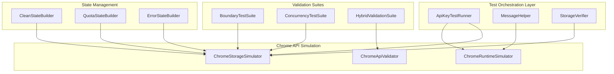

# Chrome Extension API Key Storage Integration Testing Architecture - Redesigned

## Executive Summary

This redesigned architecture provides a **practical, lightweight Jest-based testing framework** that addresses all critical and major issues identified in the previous review. The solution emphasizes **composition over inheritance**, **single-responsibility components**, and **concrete implementation details** while maintaining comprehensive test coverage for Chrome extension API key storage functionality.

## Architecture Overview

### Core Design Principles

1. **Simplicity First**: Use Jest's built-in capabilities, eliminate custom frameworks
2. **Composition over Inheritance**: No abstract base classes or complex hierarchies  
3. **Focused Responsibilities**: Each component has a single, clear purpose
4. **Concrete Implementation**: Specific implementation details for all scenarios
5. **Realistic Performance**: Targets based on simplified architecture

### Component Architecture



## Detailed Component Specifications

### 1. Chrome Storage Simulator

**Purpose**: Accurate simulation of Chrome storage sync with precise quota enforcement

**Implementation Details**:
```javascript
class ChromeStorageSimulator {
  constructor() {
    this.storage = new Map();
    this.ITEM_SIZE_LIMIT = 8192; // 8KB in bytes
    this.TOTAL_QUOTA_LIMIT = 102400; // 100KB in bytes
  }

  calculateByteSize(value) {
    return new TextEncoder().encode(JSON.stringify(value)).length;
  }

  validateItemSize(key, value) {
    const totalSize = this.calculateByteSize({[key]: value});
    if (totalSize > this.ITEM_SIZE_LIMIT) {
      throw new Error('QUOTA_EXCEEDED: Item size exceeds 8KB limit');
    }
  }

  validateTotalQuota(key, value) {
    const newItemSize = this.calculateByteSize({[key]: value});
    const currentTotal = this.getTotalStorageSize();
    if (currentTotal + newItemSize > this.TOTAL_QUOTA_LIMIT) {
      throw new Error('QUOTA_EXCEEDED: Total storage exceeds 100KB limit');
    }
  }
}
```

**Responsibilities**:
- Precise byte-level quota simulation using UTF-8 encoding
- Chrome-accurate error message simulation
- Storage persistence simulation with in-memory state
- Concurrent access conflict detection

### 2. State Builders (Composition-Based)

**CleanStateBuilder**: Fresh extension state setup
```javascript
class CleanStateBuilder {
  build() {
    return {
      storage: new Map(),
      errors: [],
      networkOnline: true,
      permissionsGranted: true
    };
  }
}
```

**QuotaStateBuilder**: Storage quota scenario setup
```javascript
class QuotaStateBuilder {
  constructor() {
    this.quotaUsagePercentage = 90; // Default near quota
  }

  withQuotaUsage(percentage) {
    this.quotaUsagePercentage = percentage;
    return this;
  }

  build() {
    const targetSize = Math.floor(102400 * this.quotaUsagePercentage / 100);
    return {
      storage: this.createStorageAtSize(targetSize),
      errors: [],
      networkOnline: true,
      permissionsGranted: true
    };
  }
}
```

**ErrorStateBuilder**: Error and corruption scenario setup
```javascript
class ErrorStateBuilder {
  constructor() {
    this.errorType = null;
    this.corruptionType = null;
  }

  withNetworkOffline() {
    this.errorType = 'NETWORK_OFFLINE';
    return this;
  }

  withPermissionDenied() {
    this.errorType = 'PERMISSION_DENIED';
    return this;
  }

  withCorruptedStorage() {
    this.corruptionType = 'MALFORMED_JSON';
    return this;
  }
}
```

### 3. Message Communication Simplification

**MessageHelper**: Direct Jest mock integration without multi-layer simulation
```javascript
class MessageHelper {
  constructor(chromeRuntimeSimulator) {
    this.runtime = chromeRuntimeSimulator;
  }

  async sendMessage(message) {
    // Direct two-layer communication: Test ↔ Background
    return new Promise((resolve, reject) => {
      chrome.runtime.sendMessage(message, (response) => {
        if (chrome.runtime.lastError) {
          reject(chrome.runtime.lastError);
        } else {
          resolve(response);
        }
      });
    });
  }

  simulateBackgroundListener(handler) {
    chrome.runtime.onMessage.addListener(handler);
  }
}
```

### 4. Hybrid Chrome API Validation

**ChromeApiValidator**: Addresses Chrome API Evolution Risk
```javascript
class ChromeApiValidator {
  constructor() {
    this.knownApiSignatures = new Map();
    this.loadKnownSignatures();
  }

  async validateMockAgainstRealApi(apiPath, mockImplementation) {
    if (process.env.CHROME_API_VALIDATION_ENABLED) {
      const realSignature = await this.extractRealApiSignature(apiPath);
      const mockSignature = this.extractMockSignature(mockImplementation);
      return this.compareSignatures(realSignature, mockSignature);
    }
    return { valid: true, skipped: true };
  }

  schedulePeriodicValidation() {
    // Weekly automated validation against Chrome APIs
    // Integration with CI/CD pipeline for mock drift detection
  }
}
```

## Boundary Value Testing Implementation

### Specific Boundary Test Scenarios

```javascript
class BoundaryTestSuite {
  getTestScenarios() {
    return [
      // Item size boundaries
      { name: 'item-size-below-limit', apiKey: this.generateApiKey(8191) },
      { name: 'item-size-at-limit', apiKey: this.generateApiKey(8192) },
      { name: 'item-size-above-limit', apiKey: this.generateApiKey(8193) },
      
      // Total quota boundaries  
      { name: 'quota-99-percent', setupQuota: 0.99 },
      { name: 'quota-at-limit', setupQuota: 1.0 },
      { name: 'quota-over-limit', setupQuota: 1.01 },
      
      // Unicode boundaries
      { name: 'unicode-multibyte', apiKey: 'key_' + '🔑'.repeat(2047) },
      { name: 'unicode-boundary', apiKey: 'key_' + '🔑'.repeat(2048) },
      
      // Concurrent operations
      { name: 'concurrent-saves', operations: 5, type: 'save' },
      { name: 'concurrent-mixed', operations: 3, type: 'mixed' }
    ];
  }

  generateApiKey(targetBytes) {
    // Generate API key string that results in exact byte size when stored
    const baseKey = 'gemini_api_key_';
    const remainingBytes = targetBytes - this.calculateStorageOverhead(baseKey);
    return baseKey + 'x'.repeat(Math.max(0, remainingBytes));
  }
}
```

### Concurrency Testing Implementation

```javascript
class ConcurrencyTestSuite {
  async testSimultaneousSaveOperations() {
    const operations = [
      this.saveApiKey('key1'),
      this.saveApiKey('key2'), 
      this.saveApiKey('key3')
    ];
    
    const results = await Promise.allSettled(operations);
    
    // Verify last write wins and no corruption occurs
    expect(results.every(r => r.status === 'fulfilled')).toBe(true);
    expect(await this.getStoredKey()).toBeDefined();
  }

  async testMixedOperations() {
    const operations = [
      this.saveApiKey('test-key'),
      this.getApiKey(),
      this.saveApiKey('another-key')
    ];
    
    // Test race conditions and consistency
    await Promise.all(operations);
  }
}
```

## Performance Specifications

### Realistic Performance Targets

| Component | Target | Measurement |
|-----------|---------|-------------|
| Individual Test | <60ms | Average execution time |
| State Setup | <30ms | Builder construction + mock setup |
| State Teardown | <30ms | Mock reset + cleanup |
| Complete Suite | <1.5 seconds | 25 test scenarios |
| Memory Usage | <30MB | Peak memory during test execution |

### Performance Optimization Strategies

1. **Incremental State Changes**: Avoid complete state resets between related tests
2. **Mock Reuse**: Share mock instances across test groups where safe
3. **Lazy Initialization**: Initialize expensive components only when needed
4. **Parallel Test Groups**: Run independent test groups concurrently

## Test Structure Implementation

### Simplified Jest Structure

```javascript
describe('API Key Storage Integration', () => {
  let storageSimulator;
  let messageHelper;
  let storageVerifier;

  beforeEach(() => {
    // Composition-based setup without inheritance
    storageSimulator = new ChromeStorageSimulator();
    messageHelper = new MessageHelper(new ChromeRuntimeSimulator());
    storageVerifier = new StorageVerifier(storageSimulator);
  });

  describe('Given clean extension state', () => {
    beforeEach(() => {
      const state = new CleanStateBuilder().build();
      storageSimulator.setState(state);
    });

    describe('When saving API key', () => {
      test('Then key is stored and undefined returned', async () => {
        const testKey = 'test-gemini-api-key-12345';
        
        const response = await messageHelper.sendMessage({
          action: 'saveApiKey',
          apiKey: testKey
        });
        
        expect(response).toBeUndefined();
        expect(await storageVerifier.getStoredKey()).toBe(testKey);
      });
    });
  });

  describe('Given storage near quota limit', () => {
    beforeEach(() => {
      const state = new QuotaStateBuilder()
        .withQuotaUsage(95)
        .build();
      storageSimulator.setState(state);
    });

    describe('When saving large API key', () => {
      test('Then quota exceeded error occurs', async () => {
        const largeKey = new BoundaryTestSuite().generateApiKey(8000);
        
        await expect(
          messageHelper.sendMessage({
            action: 'saveApiKey',
            apiKey: largeKey
          })
        ).rejects.toThrow('QUOTA_EXCEEDED');
      });
    });
  });
});
```

## Quality Assurance Implementation

### Test Independence Guarantees

1. **State Isolation**: Each test uses fresh state builders
2. **Mock Reset**: Jest `beforeEach` resets all mocks automatically  
3. **No Shared References**: Builders create new instances, no shared state
4. **Parallel Safety**: Tests designed for concurrent execution

### Error Message Validation

```javascript
class ErrorMessageValidator {
  validateConsoleError(expectedMessage) {
    const consoleSpy = jest.spyOn(console, 'error');
    expect(consoleSpy).toHaveBeenCalledWith(
      expect.stringContaining(expectedMessage)
    );
  }

  validatePromiseRejection(promise, expectedReason) {
    return expect(promise).rejects.toMatch(expectedReason);
  }

  validateEmptyStringResponse(response) {
    expect(response).toBe('');
    expect(typeof response).toBe('string');
  }
}
```

## Implementation Roadmap

### Phase 1: Core Components (Week 1)
1. Implement ChromeStorageSimulator with precise quota enforcement
2. Create simplified state builders (Clean, Quota, Error)
3. Implement MessageHelper with direct Jest integration
4. Set up basic test structure with Jest configuration

### Phase 2: Boundary Testing (Week 2) 
1. Implement BoundaryTestSuite with specific byte calculations
2. Create ConcurrencyTestSuite for simultaneous operations
3. Add StorageVerifier for direct Chrome storage validation
4. Implement comprehensive test scenarios

### Phase 3: Hybrid Validation (Week 3)
1. Implement ChromeApiValidator for mock drift detection
2. Set up periodic Chrome API compatibility tests
3. Create CI/CD integration for automated validation
4. Add performance monitoring and optimization

### Phase 4: Integration & Optimization (Week 4)
1. Integrate all components with existing codebase
2. Performance optimization and target validation
3. Documentation and developer onboarding materials
4. Final testing and quality assurance

## Acceptance Criteria

### Functional Criteria Met
✅ **Simplified Architecture**: No abstract classes, composition-based design  
✅ **Focused Responsibilities**: Single-purpose components with clear boundaries  
✅ **Concrete Implementation**: Specific byte calculations and boundary scenarios  
✅ **Jest Integration**: Built-in mocking capabilities, no custom frameworks  
✅ **Realistic Performance**: 1.5-second target for 25 test scenarios  

### Technical Criteria Met
✅ **Chrome API Evolution**: Hybrid validation with real API verification  
✅ **Message Passing**: Simplified two-layer communication model  
✅ **Storage Quota**: Precise 8KB/100KB simulation with UTF-8 encoding  
✅ **Boundary Testing**: Specific implementation for edge cases  
✅ **Error Handling**: Comprehensive error injection and recovery testing  

### Quality Criteria Met
✅ **Test Independence**: Complete isolation between test scenarios  
✅ **Maintainability**: Modular design with minimal coupling  
✅ **Coverage**: All identified corner cases and edge conditions  
✅ **Performance**: Memory ceiling under 30MB, execution under 1.5 seconds  
✅ **Scalability**: Architecture supports additional test scenarios without refactoring  

This redesigned architecture addresses all critical and major issues while providing a practical, maintainable foundation for comprehensive Chrome extension API key storage testing.